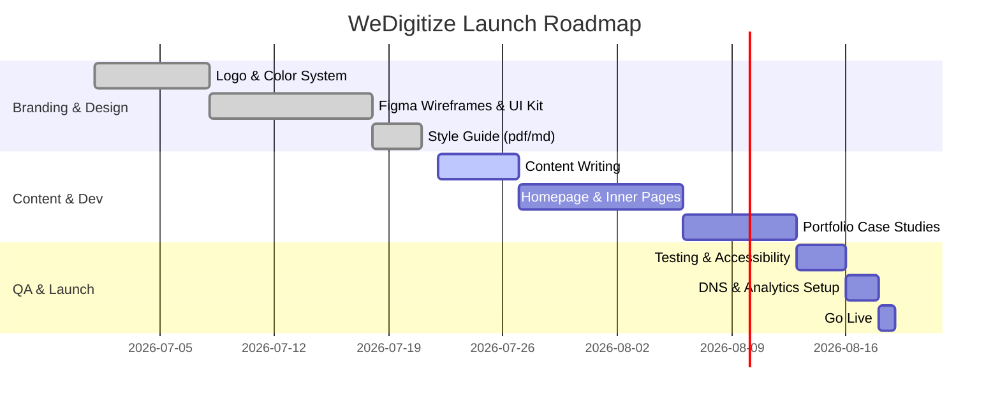

# WeDigitize Brand & Website Strategy

## Executive Summary  
WeDigitize is a new digital agency focused on building modern, effective online presences for small businesses and startups. Our brand embodies **growth, partnership, and trust**, using a crisp green-and-gray palette and the friendly “Sora” typeface. The tagline **“Building Digital Presence. Empowering Growth.”** distills our mission. This 20+ page guide covers brand positioning, visual identity rules, UI design system, website architecture, sample copy, and launch & marketing plans. It is designed as a step-by-step blueprint for designers and developers to implement a cohesive brand and high-performance website.  

## Brand Positioning & Personality  
WeDigitize positions itself as **a collaborative growth partner**, not just a coder shop. We are a friendly “coach” helping clients amplify their digital presence. Our values and personality are:  
- **Empowering & Trustworthy**: We make complex tech accessible, guiding clients with clarity and integrity.  
- **Ambitious & Supportive**: We inspire clients to grow online, celebrating small wins while aiming high.  
- **Modern & Approachable**: Our tone is optimistic and straightforward. We avoid jargon and emphasize clear benefits.  

A strong brand identity is more than just a logo or tagline; it conveys the company’s values, mission and personality. WeDigitize’s identity (logo, colors, typography) will consistently reflect **approachability and growth**, to build confidence among startups and small businesses.  

## Logo Usage Rules  
- **Clear Space:** Maintain at least *X* units of padding around the logo in all directions. A common practice is to use a fraction of the logo height (e.g. the cap-height or a chosen “x” unit) as the clear-space radius. This ensures the logo is never crowded. For example, use the logo’s capital “W” height to define margin space on all sides.  
- **Minimum Size:** In digital use, the logo should never be smaller than ~120px wide (or the equivalent in print) to remain legible. For print/small formats, ensure the logomark is at least ~1 inch across.  
- **Variants:** Provide the full-color logo (green + gray), a monochrome green logo, and an all-white version. Use the green-on-light version on white/off-white backgrounds, and the white logo on dark backgrounds. Do **not** use pure black, which can appear harsh on white.  
- **Do’s and Don’ts:** Do place the logo on ample whitespace; do use the specified colors. Don’t rotate, distort or recolor the logo. Avoid placing the logo on visually busy images without a solid contrast panel.  

## Color System  
Consistent color usage strengthens brand recognition. WeDigitize’s primary palette is:

| Color                 | HEX       | RGB             | HSL                 | Usage                          |
|-----------------------|-----------|-----------------|---------------------|--------------------------------|
| **Brand Green (Primary)**   | `#00C463` | `rgb(0, 196, 99)`   | `hsl(150°, 100%, 38%)` | Call-to-actions, accents, links. Reflects growth and energy.  |
| **Dark Gray (Secondary)**   | `#1C1C1F` | `rgb(28, 28, 31)`   | `hsl(240°, 5%, 12%)`  | Main text and headings. (Nearly black but softer.) |
| **Off-White (Background)**  | `#FAFAFA` | `rgb(250, 250, 250)`| `hsl(0°, 0%, 98%)`    | Page backgrounds and surfaces. |
| **White (Surface)**         | `#FFFFFF` | `rgb(255, 255, 255)`| `hsl(0°, 0%, 100%)`   | Cards, containers, negative space. |
| **Light Gray (Borders)**    | `#EAEAEA` | `rgb(234, 234, 234)`| `hsl(0°, 0%, 92%)`    | Dividers, form fields, disabled states. |
| **Green Hover (Accent)**    | `#00D977` | – (20% lighter green) | –                 | Hover state for buttons/links (Text on this should be Dark Gray for contrast). |
| **Dark Gray Focus (Accent)**| `#373737` | – (lightened dark gray) | –                | Focus states (e.g. outline or button hover) on Dark Gray backgrounds. |

Primary colors identify the brand, while secondary colors highlight and complement them. Note: pure black (#000000) is **avoided** for large areas or text, as it can strain the eyes on digital screens. Dark Gray (#1C1C1F) is used instead to reduce contrast strain.

When combining colors: use the green as the dominant accent. Secondary gray shades provide neutral balance. Monochrome tints or grayscale steps (white to dark) allow flexible design (e.g. backgrounds to dark gray for text). Ensure sufficient contrast: all text-on-color or color-on-text must meet WCAG guidelines (contrast ≥ 4.5:1 for normal text). For example, Dark Gray text on Off-White background (~17:1) is excellent; Brand Green on white (~2.3:1) is too low for text but can work for large graphics or with Dark Gray text overlay. 

**Color Example Usage:** Primary green buttons with white or dark text, gray text on light backgrounds, green icons on white, dark gray header/footer with white text. 

## Typography System  
WeDigitize uses **Sora** (Google Font) for all headings and body text, paired with common system sans-serifs as fallbacks. According to MDN, always include a generic fallback in the font stack. Example CSS stack:

```css
font-family: 'Sora', system-ui, -apple-system, BlinkMacSystemFont, 'Segoe UI', Roboto, 'Helvetica Neue', Arial, sans-serif;
```

**Font weights:** We use Sora at multiple weights (normal 400, semibold 600, bold 700) to create visual hierarchy. For body text, 400 (normal) and for headings 600–700.

**Font Sizes (Desktop typical):**  
| Text Element      | Size (px) | Weight | Line-Height | Notes |
|-------------------|-----------|--------|-------------|-------|
| H1 (Page Title)   | 48px      | 600    | 1.3         | Biggest attention-grabber. |
| H2 (Section Title)| 36px      | 600    | 1.4         | Secondary headings. |
| H3                | 28px      | 600    | 1.4         | Smaller headings. |
| H4                | 22px      | 600    | 1.4         | Minor headings. |
| H5                | 18px      | 600    | 1.5         | Smaller contexts. |
| H6                | 16px      | 600    | 1.5         | Small headings. |
| Paragraph (P)     | 16px      | 400    | 1.6         | Body copy. |
| Caption/Label     | 14px      | 400    | 1.4         | Fine print, captions. |

**Line-height and Letter-spacing:** We set comfortable line-heights (~1.4–1.6) for readability. For example, body text at 16px has ~24px line-height. Letter-spacing is typically 0 for body; headings may use +0.5px if needed for clarity at large display sizes. 

**Web-safe Alternatives:** In case Sora fails to load, the stack includes broadly available system fonts (e.g. Segoe UI, Arial, sans-serif). This ensures consistent look across platforms. 

## UI Design Tokens  

### Spacing  
We use an 8px grid as the base unit for margins, padding and gaps. All spacing values are multiples of 8px (8, 16, 24, 32, 48, 64, …) to maintain consistency. For example, section vertical padding might be 80px (10×8). Atlassian’s design system notes that *“each spacing value is a multiple of the base unit… to allow flexibility while still maintaining consistency”*. This rhythmic scale simplifies layouts and responsive adjustments. 

### Border Radius  
Consistent corner radii make UI elements cohesive. We adopt a “medium” radius of **16px** for cards, buttons, and other components, as recommended by design systems. (A smaller 8px radius could be used for tight forms, and a larger ~24px for very large containers if needed.) According to Duet’s token guide, a 16px *intermediate* radius is useful when 12px is too small but a very large curve is undesired. Our global CSS variable might be `--radius: 16px;` for most elements. 

### Shadows  
Use very subtle shadows for depth. Example: `box-shadow: 0 8px 24px rgba(0,0,0,0.06);` on cards to lift them from the background. (This is inspired by Material Design’s “8dp” elevation style.) Avoid heavy shadows; our emphasis is on light, modern flat design. (Shadow tokens from Material/atlassian can guide, though not strictly needed.) 

### Grid & Breakpoints  
We use a fluid responsive layout with max-width containers at ~1280px (desktop). Key breakpoints (mobile-first approach) are approximately:  
- **<= 480px:** Small phones (portrait).  
- **481px–768px:** Larger phones and small tablets (stack layout).  
- **769px–1024px:** Tablets (multi-column begins).  
- **1025px–1280px:** Laptops/small desktops.  
- **1281px–1440px:** Large desktops.  
- **1441px+:** Extra-large/4K screens.  

These align with common industry ranges. Use `@media (min-width:…)` queries (mobile-first). For example, `@media (min-width: 1024px) { /* desktop layout */ }`. 

According to one guide, typical responsive breakpoints include ~320–600px (mobile), ~601–1024px (tablet), ~1025–1440px (desktop). We tailor this to WeDigitize’s content while ensuring the navbar collapses into a hamburger by ~768px. 

### CSS Variables (Token Examples | Not Mendatory)  
```css
:root {
  /* Colors */ 
  --color-primary: #00C463; 
  --color-secondary: #1C1C1F; 
  --color-background: #FAFAFA;
  --color-surface: #FFFFFF;
  --color-border: #EAEAEA;
  /* Typography */
  --font-family: 'Sora', system-ui, ...;
  --font-weight-normal: 400;
  --font-weight-semibold: 600;
  /* Spacing */
  --space-1: 8px;
  --space-2: 16px;
  --space-3: 24px;
  --space-4: 32px;
  --space-5: 48px;
  /* Radius */
  --radius-medium: 16px;
  /* Breakpoints */
  --breakpoint-sm: 600px;
  --breakpoint-md: 1024px;
  --breakpoint-lg: 1440px;
}
```

## Page Wireframes & Content Outlines

Below are simplified wireframe outlines and content sections for main site pages:

- **Home:** Hero (headline + CTA), Services summary (cards), Process overview (steps/diagram), Portfolio preview (featured projects), Trust strip (e.g. logos or bullets of benefits), Testimonials (optional), Blog teaser, Final CTA banner, Footer.
- **Services:** List of services with icons, detailed descriptions of each (Web Design, Apps, SEO, CMS, Consulting), process infographic, FAQ, CTA.
- **Portfolio:** Gallery of project thumbnails (with title, short description), filter by industry (optional). Each item links to a case study page. Include a lead-in text about expertise.
- **Portfolio Case Study (Example):** Project title, header image, problem statement, solution description, role & technologies, screenshots, outcome/results, client quote.
- **About:** Company story/mission, team photo, individual bios or values, timeline, press or trust logos, CTA (“Work with us”).
- **Contact:** Contact form (as above), contact info (email, phone), map (if local), and a friendly call-to-action to book a consult.
- **Blog:** Intro text, list of blog posts (title, snippet, “Read more”), categories or tags, CTA to newsletter. Each post page with title, image, content, author byline, share links.

```mermaid
flowchart LR
    subgraph SiteMap
      Home --> Services
      Home --> Portfolio
      Home --> About
      Home --> BNlog
      Home --> Contact
    end
    Services --> Web_Dev[Web Development]
    Services --> Mobile_Apps
    Services --> SEO
    Services --> CMS
    Services --> Consulting
    Portfolio --> Case1[Project A (Gym)]
    Portfolio --> Case2[Project B (Cafe)]
    Portfolio --> Case3[Project C (Clinic)]
    Portfolio --> Case4[Project D (Architect)]
    Contact --> Form
```

Each page’s metadata (HTML title/meta description) should use keywords and be concise: e.g., **Home:** Title “WeDigitize – Web Design, SEO & Digital Solutions”. Description: “WeDigitize builds modern websites and apps that help startups and small businesses grow online. Learn about our services or book a free consultation.” The Services, Portfolio, About pages should similarly have keyword-rich titles and descriptions under ~155 characters.

### Sample Copy Snippets  
- **Hero Headline:** *“Professional Websites & Digital Solutions for Growing Businesses.”*  
- **Hero Subtext:** *“We create modern, responsive websites and apps that help your business stand out and generate customers.”*  
- **Services Intro:** *“Our Services: From custom websites to SEO and digital strategy, we have you covered.”*  
- **Process Steps:** (e.g.,) *1. Consult – We learn your needs. 2. Design – We craft UX/UI mockups. 3. Build – We develop your site. 4. Launch – We go live and optimize.*  
- **Trust Strip:** *“Responsive Design ✔ SEO Optimized ✔ Fast & Secure ✔ Ongoing Support ✔”* (with icons).  
- **Call to Action:** *“Ready to build your digital presence? **Contact us** today for a free consultation!”*  
- **Meta Titles/Descriptions:** As noted above, include keywords and brand name, e.g. *“Contact WeDigitize – Free Consultation for Website Projects”*.

## Imagery & Illustration Guidance  
Use a **consistent style of imagery** throughout: either high-quality photography or modern flat/abstract illustrations that align with the tech-savvy yet approachable brand. Suggested themes: people collaborating, business/tech imagery, abstract shapes in brand green. For non-stock feel, prefer custom or curated assets (e.g. undraw.co-style tech illustrations, or carefully licensed photos). All images should have meaningful alt text (per WCAG 1.1.1). Use SVG icons or illustrations for process steps and key features to ensure sharpness. 

### Portfolio Demo Briefs  
Create 4 representative case studies (no NDA issues):
1. **Local Gym Website** – A responsive site for a fitness studio. Needs class schedules, trainer bios, and signup CTA. Use energetic imagery (people exercising). Include a booking form.  
2. **Cafe/Restaurant Website** – Showcasing menu, online reservation form, and gallery. Use warm, appetizing food photos. Include map and hours. CTA “Book a Table”.  
3. **Medical Clinic Website** – Professional look with patient portal link. Include services (pediatrics, etc.), doctor bios, appointment scheduler integration. Use calm, reassuring visuals.  
4. **Architect Portfolio** – A sleek site featuring project galleries (photos of designs). Emphasize visuals over text. CTA “View Case Study”. Light, minimalist design.  
For each, prepare 2–3 wireframe slides: homepage layout and one inner page (like service or gallery), with placeholder text noting client needs, then create sample visuals (the mockups themselves would go in the design deliverables).

## Accessibility Checklist  
Ensure WCAG 2.1 AA compliance where feasible. Key points:  
- **Contrast:** All text ≥4.5:1 contrast. Primary green on white is only ~2.3:1, so use it sparingly for text (better for icons/buttons with dark text on green or white text on green *only if large/bold*).  
- **Alt Text:** Every image/illustration must have descriptive alt text. Decorative images should have empty alt="" so screen readers skip them.  
- **Keyboard Navigation:** All buttons/links must be accessible via Tab. Use `<button>` for actions, and ensure focus styles are visible. The form fields above show a clear focus outline (using green with some transparency).  
- **Headings & Structure:** Use semantic HTML (`<h1>` through `<h6>`) to reflect content hierarchy. Each page gets one `<h1>`.  
- **Form Labels:** All form inputs have associated `<label>` tags. We show above each input, or use `placeholder` + `aria-label`.  
- **ARIA & Landmarks:** Use ARIA roles where helpful (e.g. `role="navigation"`, `role="main"`), and landmarks (`<header>`, `<nav>`, `<main>`, `<footer>`, etc.) to aid screen readers.  
- **Responsiveness:** The site must work on all screen sizes (so mobile views reflow logically). This also improves accessibility for all users.  
Adhering to standards not only helps users, but also often improves SEO and mobile usability.

## Performance Checklist  
Optimize site speed and performance for good user experience and SEO:  
- **Responsive Images:** Use `srcset` to load appropriately sized images for each device. Consider modern formats (WebP).  
- **Lazy Loading:** Defer offscreen images until needed.  
- **Minify/Caching:** Minify CSS/JS, and leverage browser caching (e.g. via service worker or CDN).  
- **Critical CSS:** Inline critical above-the-fold CSS if possible.  
- **Fonts:** Host Google Fonts locally or use `font-display: swap` to avoid render-blocking. Load only needed weights (e.g. 400,600).  
- **Check Core Web Vitals:** Ensure LCP, FID, CLS metrics are in good range (fast load, no layout shifts).  

Following these practices (and tools like Google Lighthouse) will make the launch smoother and improve SEO/ranking. 

## Technical Launch Checklist  
- **Domain & Hosting:** Purchase a domain (e.g. `wedigitize.com` or `.in` if needed). Configure DNS to point to the chosen host. For a custom site, we recommend static/DigitalOcean/Vercel/Netlify with continuous deploy (e.g. via GitHub). Alternatively, WordPress on managed hosting or Webflow could be used.  
- **Email:** Set up professional email (e.g. `you@wedigitize.com`) via Google Workspace or similar (MX records in DNS).  
- **Analytics & SEO:** Install Google Analytics (or alternative) tracking code site-wide. Create a Google Search Console property and submit the sitemap.xml. Add meta tags and OpenGraph tags (for social sharing). Include `<meta name="viewport" content="width=device-width, initial-scale=1">` for mobile.  
- **SSL Certificate:** Enable HTTPS (Let's Encrypt or host-managed) before launch so the site is secure.  
- **Performance Setup:** Use a CDN (like Cloudflare) to speed up global delivery. Check mobile speed.  
- **CMS/Build:** If using a framework (Next.js, Gatsby, etc.), ensure build scripts are ready. If using WordPress+Elementor, set up themes/templates according to the style guide. Train content editors on how to use the page templates.  
- **Testing:** Verify all links, forms and navigation work. Test on multiple browsers/devices. Check accessibility with a tool (e.g. WAVE, Lighthouse).  
- **Launch:** Deploy the final build. Do a quick on-site SEO audit. Announce launch (update social media, etc.).



## Marketing & Growth Roadmap  
WeDigitize’s first 10 clients will be obtained through targeted outreach and inbound content. Key strategies:  
- **Portfolio & Referrals:** Feature the 4 demo projects on the site as proof of capability. Encourage family/friends feedback. Ask satisfied clients for referrals.  
- **Local Networking:** Attend startup meetups and co-working spaces to pitch our services. A business card and flyer can help (door-knock local businesses as needed).  
- **Online Profiles:** Create/optimize Google My Business, LinkedIn company page. Request reviews. Engage in relevant online forums.  
- **Content Marketing:** Start a blog (1 post/week) targeting keywords like “Small business web design tips”, “Affordable SEO for startups”, etc. This builds organic traffic over time. Share posts on social media.  
- **Social Proof:** Add testimonial quotes and success metrics to the site once acquired (e.g. “Increased client’s leads by 30% in 3 months”).  
- **Paid Ads:** Once a brand is established, consider Google Ads or Facebook Ads targeting local businesses.  

A simple editorial calendar (month-by-month) might include blog posts on topics like “5 must-haves for a small business website” or “Website launch checklist” to attract leads.  

## Assets to Deliver  
- **Figma (or Design) File:** Complete layout of all screens (desktop/mobile) including style components.  
- **Logo Files:** SVG, PNG of color logo, white logo, and icon/favicons (32×32px, 16×16px).  
- **Style Guide PDF/Markdown:** This document, professionally formatted for print/onscreen. (Files named e.g. `WeDigitize_Brand_Website_Blueprint.pdf` and `.md`.)  
- **CSS Snippets:** Example component CSS (as above) for developer reference.  
- **Image Assets:** Folder with finalized images/illustrations used.  
- **Webpages:** Exported HTML/CSS if static, or theme files if CMS (e.g. WordPress theme).  

Tables above provide color codes and typography scale. Note any placeholders: domains or client logos are to be updated. All content text and images should be finalized before launch. 

By following this guide, the WeDigitize team can build a unified brand and a high-quality website step-by-step, ensuring consistency, usability and strategic growth from day one.

**Sources:** We consulted best-practice guides for brand and web design (including Google Fonts, W3C WCAG standards, and leading design systems) to inform all specifications. These references underline the rationale for our choices.